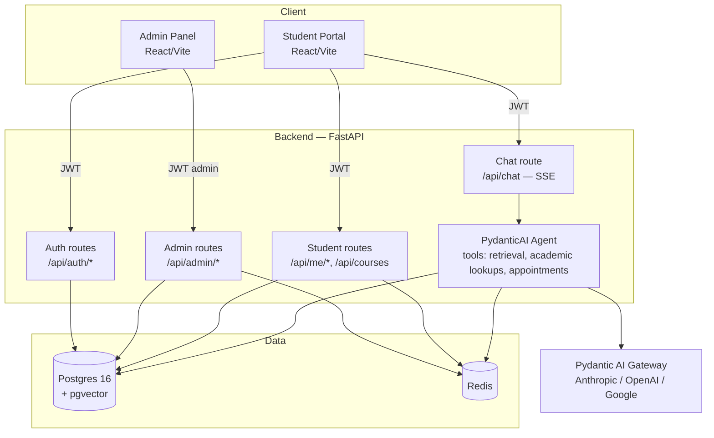

# Eurisko University Assistant

An AI-powered student portal and admin panel for Eurisko University. Students log in with just
their student ID and chat with an assistant that can answer questions grounded in two source PDFs
(the Student Handbook and Course Catalogue) via retrieval-augmented generation, and can also
answer questions about the student's own record — GPA, degree progress, schedule, course
eligibility — by querying the database directly through agent tools. Admins get a separate panel
to manage students, courses, enrollments, uploaded documents, and the assistant's persona/model
configuration.

The backend is FastAPI + SQLAlchemy (async) + Postgres (with pgvector) + Redis + PydanticAI. The
frontend is a React + TypeScript + Vite SPA with two themed surfaces: an indigo student portal and
a slate admin panel.

## Prerequisites

- Docker and Docker Compose
- A [Pydantic AI Gateway](https://gateway.pydantic.dev) API key (used to reach the LLM providers)

## Getting it running

```bash
git clone <this repo>
cd Uni-Project
cp .env.example .env   # then fill in PYDANTIC_AI_GATEWAY_API_KEY (and anything else you want to change)
docker compose up --build
```

That's it — no manual migration or seeding step. On first boot the backend container runs, in
order: Alembic migrations, structured-data loading (students, courses, enrollments, ... from the
source spreadsheet), then PDF ingestion (chunking + embedding + indexing the Handbook and
Catalogue). All three steps are idempotent, so restarting the stack later re-runs them safely
without duplicating data or re-paying for embeddings on unchanged documents.

Once it's up:

| Service | URL |
|---|---|
| Frontend (student portal + admin panel) | http://localhost:5174 |
| Backend API + docs | http://localhost:8000/docs |
| Postgres (host access) | localhost:5433 |
| Redis (host access) | localhost:6379 |

The frontend container listens on Vite's default port 5173 *inside* the container, but is
published to **host port 5174** (see `docker-compose.yml`) — a prior local port conflict on 5173,
kept as-is since it doesn't affect anything inside the Docker network.

## Architecture



## Database schema

```mermaid
erDiagram
    PROGRAMS ||--o{ REQUIREMENT_CATEGORIES : has
    PROGRAMS ||--o{ STUDENTS : enrolls
    REQUIREMENT_CATEGORIES ||--o{ CATEGORY_COURSES : includes
    COURSES ||--o{ CATEGORY_COURSES : "counts toward"
    COURSES ||--o{ COURSE_PREREQUISITES : "requires (course_code)"
    COURSES ||--o{ COURSE_PREREQUISITES : "is prereq for (prerequisite_course_code)"
    COURSES ||--o{ ENROLLMENTS : "taken via"
    COURSES ||--o{ CLASS_SCHEDULE : "scheduled as"
    STUDENTS ||--o{ ENROLLMENTS : has
    STUDENTS ||--o{ APPOINTMENTS : requests
    STUDENTS ||--o{ CHAT_SESSIONS : owns
    TERMS ||--o{ STUDENTS : "entry term"
    TERMS ||--o{ ENROLLMENTS : "taken in"
    TERMS ||--o{ CLASS_SCHEDULE : "offered in"
    GRADING_SCALE ||--o{ ENROLLMENTS : grades
    DOCUMENTS ||--o{ DOC_CHUNKS : "chunked into"
    CHAT_SESSIONS ||--o{ CHAT_MESSAGES : contains

    PROGRAMS {
        string program_code PK
        string program_name
        int total_credits_required
    }
    REQUIREMENT_CATEGORIES {
        string category_id PK
        string program_code FK
        string category_name
        int credits_required
    }
    COURSES {
        string course_code PK
        string title
        int credits
        text description
    }
    CATEGORY_COURSES {
        string category_id PK_FK
        string course_code PK_FK
    }
    COURSE_PREREQUISITES {
        string course_code PK_FK
        string prerequisite_course_code PK_FK
    }
    STUDENTS {
        string student_id PK
        string first_name
        string last_name
        string email
        string program_code FK
        string entry_term FK
        string expected_graduation_term
        string academic_status
        string advisor_name
        text scenario_note
    }
    TERMS {
        string term_code PK
        string term_name
        date start_date
        date end_date
        int sort_order
    }
    ENROLLMENTS {
        string student_id PK_FK
        string term_code PK_FK
        string course_code PK_FK
        int credits
        string grade FK
        string status
    }
    GRADING_SCALE {
        string grade PK
        numeric grade_points
        bool earns_credit
        bool included_in_gpa
    }
    CLASS_SCHEDULE {
        int id PK
        string term_code FK
        string course_code FK
        string days
        time start_time
        time end_time
        string room
        string instructor
    }
    DOCUMENTS {
        int id PK
        string filename
        string doc_type
        datetime uploaded_at
        datetime indexed_at
        string status
        int chunk_count
        string checksum
    }
    DOC_CHUNKS {
        int id PK
        int document_id FK
        text content
        int page
        string section_number
        string section_title
        string doc_type
        vector embedding
        tsvector tsv
    }
    ASSISTANT_CONFIG {
        int id PK
        text persona
        string model_provider
        string model_name
        string response_length
        numeric temperature
        datetime updated_at
    }
    APPOINTMENTS {
        int id PK
        string student_id FK
        text reason
        string preferred_time
        string status
        datetime created_at
        datetime updated_at
    }
    CHAT_SESSIONS {
        int id PK
        string student_id FK
        datetime created_at
        datetime updated_at
    }
    CHAT_MESSAGES {
        int id PK
        int session_id FK
        string role
        text content
        datetime created_at
    }
```

## API endpoints

All routes except login are JWT-protected; the token's role (`student` or `admin`) determines
which group a route belongs to. Student-scoped routes never accept a `student_id` from the client
— the ID always comes from the JWT.

### Public (no auth)

| Method | Path | Description |
|---|---|---|
| POST | `/api/auth/student/login` | Log in with a student ID, get a student JWT |
| POST | `/api/auth/admin/login` | Log in with username/password, get an admin JWT |

### Student-scoped (`get_current_student`)

| Method | Path | Description |
|---|---|---|
| GET | `/api/me` | Profile, GPA, total credits |
| GET | `/api/me/schedule` | Current-term class schedule |
| GET | `/api/me/courses` | Full course history, grouped by term, with per-term GPA |
| GET | `/api/me/degree-progress` | Progress per requirement category *(cached — see below)* |
| GET | `/api/me/eligibility/{course_code}` | Whether the student can register for a course |
| GET | `/api/courses` | Full course catalogue with prerequisites |
| POST | `/api/chat` | Chat with the assistant (SSE stream) |
| GET | `/api/me/chats` | List past chat sessions |
| GET | `/api/me/chats/{session_id}` | Messages in one chat session |
| GET | `/api/me/appointments` | This student's advisor appointment requests |
| POST | `/api/me/appointments/{id}/approve` | Approve an agent-proposed appointment |

### Admin-only (`require_admin`)

| Method | Path | Description |
|---|---|---|
| GET | `/api/admin/stats` | Dashboard counts (students, courses, enrollments, documents) |
| GET | `/api/admin/documents` | List uploaded/seeded documents and their indexing status |
| POST | `/api/admin/documents` | Upload a new PDF and start ingestion |
| POST | `/api/admin/documents/{id}/reindex` | Re-run ingestion for an existing document |
| DELETE | `/api/admin/documents/{id}` | Delete a document and its chunks |
| GET | `/api/admin/students` | List all students with summary GPA/credits |
| GET | `/api/admin/students/{student_id}` | Full detail for one student (the one legitimate place a `student_id` appears in a URL path, gated by `require_admin`) |
| GET | `/api/admin/courses` | All courses with prerequisites and category membership |
| GET | `/api/admin/enrollments` | Paginated enrollment list, filterable by student/term |
| GET | `/api/admin/config` | Current assistant persona/model/temperature config |
| PUT | `/api/admin/config` | Update assistant config (takes effect on the very next chat message — never cached) |

## Test accounts

Five seeded students (login with just the student ID, no password):

| Student ID | Name |
|---|---|
| S2023011 | Maya Haddad |
| S2023027 | Jad Mansour |
| S2024019 | Karim Nassar |
| S2025008 | Rania Khoury |
| S2026042 | Lynn Abou Chakra |

Admin login: **username** `admin`, **password** `admin123` (see `.env` — change before any
real deployment).

## Running the test suite

The backend test suite needs the Postgres/Redis containers up and seeded (it runs some
integration tests against the real database on the host-mapped ports):

```bash
docker compose up -d postgres redis backend   # or the full stack
cd backend
uv sync
uv run pytest
```

There is no frontend test suite at this time.
